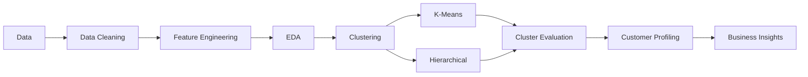

# Customer Segmentation
## Project Overview

## Problem Statement
The objective of this project is to **Segment customers** from a retail/marketing dataset (demographics + purchase behavior across web, catalog, and store channels) into meaningful groups to support targeted marketing strategies.

---

## Dataset
The dataset contains information about customers:

~2,200 customers with features including income, age, education, marital status, spending across 6 product categories, purchase counts by channel, campaign response history, and recency.

---

## Project Workflow

---

## Exploratory Data Analysis
1. **55%** of customers are from age group **40-60** years old. We can create a new feature **AgeGroup** based on this.

  | Age Group | Percentage |
  |---|---:|
  | <40 | 6.59% |
  | 40–60 | 55.10% |
  | >60 | 38.31% |
  | **Total** | **100.00%** |
  
2. We can observe that customers having higher education tends to sepend more than those with basic and 2n cycle eduction. This features also have moderate correlation(~0.67) with each other.
  

3. The **income distributions of Graduate and PhD customers are relatively similar**, with a few outliers in both groups. One **extreme outlier** is also present and may indicate a potential data-entry issue that should be investigated.
   The **median income across Single, Together, Married, and Divorced customers is relatively similar**. However, some outliers are present, particularly among **Together and Married** customers.

4. The following features were created during feature engineering:

| Feature | Description |
|---|---|
| **Age** | Age of the customer as of 2026. |
| **Total no. of Children** | Total number of children and teenagers in the household, calculated using `Kidhome` and `Teenhome`. |
| **Total Spending** | Total amount spent on wines, fruits, meat, fish, sweets, and gold products. |
| **Customer_Since** | Customer tenure calculated up to **09/09/2026**. |
| **AcceptedCampaigns** | Total number of marketing campaigns accepted, including the current campaign. |
| **AcceptedAny** | Binary indicator (1/0) showing whether the customer accepted at least one marketing campaign. |

---  

### Key findings:
 - **Average income increases substantially with age**. The 18–29 age group has the lowest average income, while customers aged 60–69 and 70+ have the highest average income.

 - In terms of total spending, the 18–29 age group has by far the lowest average spending. Spending increases for the 30–39 group, decreases for the 40–49 and 50–59 groups and increases again among customers aged 60–69 and 70+.
     
 - Interestingly, although the average income of customers aged **30–39, 40–49, and 50–59 is relatively similar**, the 30–39 group has considerably higher average spending than the 40–49 and 50–59 groups. This suggests that income alone may not explain differences in spending behavior across age groups.
  

 - `Income` of **666666.0** is likely an data error.

|      | **ID** | **Year_Birth** | **Education** | **Marital_Status** | **Income** | **Kidhome** | **Teenhome** | **Dt_Customer** | **Recency** | **MntWines** | **...** | **NumWebVisitsMonth** | **AcceptedCmp3** | **AcceptedCmp4** | **AcceptedCmp5** | **AcceptedCmp1** | **AcceptedCmp2** | **Complain** | **Z_CostContact** | **Z_Revenue** | **Response** |
| ---: | -----: | -------------: | ------------: | -----------------: | ---------: | ----------: | -----------: | --------------: | ----------: | -----------: | ------: | --------------------: | ---------------: | ---------------: | ---------------: | ---------------: | ---------------: | -----------: | ----------------: | ------------: | -----------: |
| 2233 | 9432 | 1977 | Graduation | Together | 666666.0 | 1 | 0 | 02-06-2013 | 23 | 9 | ... | 6 | 0 | 0 | 0 | 0 | 0 | 0 | 3 | 11 | 0 |

 - Including **AgeGroup** in the clustering feature space substantially improved the clustering results.
---

## Data Preprocessing
- **log(1+x)** transformation to `Income`, `NumCatalogPurchases`, `NumWebPurchases` features and **sqrt** transfomrton to `NumStorePurchases`.

## Machine Learning Models
The following models were evaluated:

## Model Evaluation
The model were evaluated using:

-Accuracy
-Precision

Since the dataset is imbalanced precision, were given greater importance
**Model Evaluation**
| MODEL | Precision | Recall | f1-score |
|---|---:|---:|---:|---:|

## Model Validation
To obtain more reliable estimate of model performance:

-
-

## Final Results
The final model achieved:

## Project Structure

Clone the repository:

git clone https://github.com/username/customer-churn-prediction.git
cd customer-churn-prediction

Create a virtual environment:

python -m venv venv

Activate the environment:
Windows
venv\Scripts\activate

Install dependencies:

pip install -r requirements.txt

## Usage
Run the application:

streamlit run app/app.py

The application allows users to enter customer information and receive a churn prediction.

## Deployment
The machine learning model was deployed using Streamlit.
The application provides an interface where users can input customer information and obtain predictions from the trained model.

## Future Improvements

## License
This project is licensed under the MIT License.

