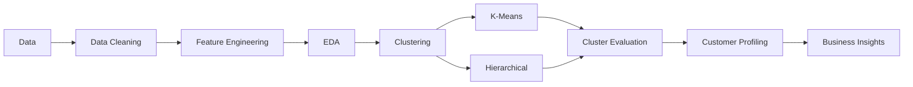

# Customer Segmentation
## Project Overview
Segmented ~2,200 retail customers into 4 distinct groups using KMeans and Hierarchical Clustering, based on demographic and purchasing behavior (income, age, spending, channel preference). Applied rigorous data cleaning, outlier handling, and cluster validation (Silhouette, Davies-Bouldin, cophenetic correlation) to ensure robust, interpretable segments for targeted marketing.

---
## Problem Statement
The objective of this project is to **Segment customers** from a retail/marketing dataset (demographics + purchase behavior across web, catalog, and store channels) into meaningful groups to support targeted marketing strategies.

---
## Dataset
The dataset contains information about customers:

~2,200 customers with features including income, age, education, marital status, spending across 6 product categories, purchase counts by channel, campaign response history, and recency.

---
## Project Workflow

---
## Exploratory Data Analysis
1. **55%** of customers are from age group **40-60** years old. We can create a new feature **AgeGroup** based on this.

  | Age Group | Percentage |
  |---|---:|
  | <40 | 6.59% |
  | 40–60 | 55.10% |
  | >60 | 38.31% |
  | **Total** | **100.00%** |
  
2. We can observe that customers having higher education tends to sepend more than those with basic and 2n cycle eduction. This features also have moderate correlation(~0.67) with each other.
  

3. The **income distributions of Graduate and PhD customers are relatively similar**, with a few outliers in both groups. One **extreme outlier** is also present and may indicate a potential data-entry issue that should be investigated.
   The **median income across Single, Together, Married, and Divorced customers is relatively similar**. However, some outliers are present, particularly among **Together and Married** customers.

4. The following features were created during feature engineering:

| Feature | Description |
|---|---|
| **Age** | Age of the customer as of 2026. |
| **Total no. of Children** | Total number of children and teenagers in the household, calculated using `Kidhome` and `Teenhome`. |
| **Total Spending** | Total amount spent on wines, fruits, meat, fish, sweets, and gold products. |
| **Customer_Since** | Customer tenure calculated up to **09/09/2026**. |
| **AcceptedCampaigns** | Total number of marketing campaigns accepted, including the current campaign. |
| **AcceptedAny** | Binary indicator (1/0) showing whether the customer accepted at least one marketing campaign. |

---  
### Key findings:
 - **Average income increases substantially with age**. The 18–29 age group has the lowest average income, while customers aged 60–69 and 70+ have the highest average income.

 - In terms of total spending, the 18–29 age group has by far the lowest average spending. Spending increases for the 30–39 group, decreases for the 40–49 and 50–59 groups and increases again among customers aged 60–69 and 70+.
     
 - Interestingly, although the average income of customers aged **30–39, 40–49, and 50–59 is relatively similar**, the 30–39 group has considerably higher average spending than the 40–49 and 50–59 groups. This suggests that income alone may not explain differences in spending behavior across age groups.
  

 - `Income` of **666666.0** is likely an data error. Removing it has improved clustering.

|      | **ID** | **Year_Birth** | **Education** | **Marital_Status** | **Income** | **Kidhome** | **Teenhome** | **Dt_Customer** | **Recency** | **MntWines** | **...** | **NumWebVisitsMonth** | **AcceptedCmp3** | **AcceptedCmp4** | **AcceptedCmp5** | **AcceptedCmp1** | **AcceptedCmp2** | **Complain** | **Z_CostContact** | **Z_Revenue** | **Response** |
| ---: | -----: | -------------: | ------------: | -----------------: | ---------: | ----------: | -----------: | --------------: | ----------: | -----------: | ------: | --------------------: | ---------------: | ---------------: | ---------------: | ---------------: | ---------------: | -----------: | ----------------: | ------------: | -----------: |
| 2233 | 9432 | 1977 | Graduation | Together | 666666.0 | 1 | 0 | 02-06-2013 | 23 | 9 | ... | 6 | 0 | 0 | 0 | 0 | 0 | 0 | 3 | 11 | 0 |

---
## Data Preprocessing
- **log(1+x)** transformation to `Income`, `NumCatalogPurchases`, `NumWebPurchases` features and **sqrt** transfomrton to `NumStorePurchases`.
- z-score standardization.

---
## Unsupervised Machine Learning Models

- KMeans Clustering
- Hierarchical Clustering

---
## Model Evaluation

The clustering models were evaluated using the following metrics:

### 1. WCSS (Within-Cluster Sum of Squares)

**Range:** [0, infinity)

**Preferred:** Lower value

**Interpretation:** Measures the compactness of clusters by calculating the total squared distance of observations from their respective cluster centroids. Lower WCSS indicates more compact clusters. It is primarily used with the **Elbow Method** to determine an appropriate number of clusters.

---
### 2. Silhouette Score

**Range:** [-1, 1]

**Preferred:** Higher value, ideally closer to **1**

**Interpretation:** Measures how well each observation fits within its assigned cluster compared with other clusters. Values close to 1 indicate well-separated and compact clusters, values around 0 indicate overlapping clusters, and negative values may indicate incorrect cluster assignments.

---
### 3. Davies-Bouldin Index (DBI)

**Range:** [0, infinity)

**Preferred:** Lower value, ideally closer to **0**

**Interpretation:** Measures the similarity between clusters based on their compactness and separation. Lower DBI indicates more compact and better-separated clusters.

---

### 4. Cophenetic Correlation Coefficient (CCC)

**Range:**  [-1, 1]

**Preferred:** Higher value, ideally closer to **1**

**Interpretation:** Measures how accurately a hierarchical clustering dendrogram preserves the original pairwise distances between observations. A higher CCC indicates that the dendrogram provides a better representation of the original distance relationships.

| Metric | Better Value |
|---|---|
| **WCSS** | Lower *(considered with the Elbow Method)* |
| **Silhouette Score** | Higher, ideally closer to **1** |
| **Davies-Bouldin Index** | Lower, ideally closer to **0** |
| **Cophenetic Correlation Coefficient** | Higher, ideally closer to **1** |
  
---
## Four Customer Segments — Quick Summary

### 1. High-Value Middle-Aged Spenders

- **Age:** 31–60 years
- **Income:** High
- **Spending:** Highest overall
- **Shopping Behavior:** Strong in-store purchasing with moderate web and catalog usage.
- **Demographics:** Generally well-educated and predominantly married or partnered.
- **Profile:** High-value customers with strong purchasing power and engagement across multiple channels.

### 2. Budget-Conscious Middle-Aged Customers

- **Age:** 30–60 years
- **Income:** Low
- **Spending:** Low
- **Shopping Behavior:** Limited web and catalog purchases with relatively low in-store activity.
- **Demographics:** Generally well-educated, with a higher proportion of single customers.
- **Profile:** Lower-value customers with limited purchasing activity and relatively low engagement.

### 3. Affluent, Engaged Seniors

- **Age:** 61–85 years
- **Income:** High
- **Spending:** High
- **Shopping Behavior:** Active across web, catalog, and physical store channels.
- **Demographics:** Predominantly married and well-educated.
- **Profile:** High-value senior customers with strong purchasing power and multi-channel engagement.

### 4. Senior, Budget-Conscious Customers

- **Age:** 61–86 years
- **Income:** Low
- **Spending:** Lowest among all segments
- **Shopping Behavior:** Very limited purchasing activity, with some preference for physical stores.
- **Demographics:** Highest proportion of widowed customers.
- **Profile:** Older, lower-income customers with limited spending and overall purchasing engagement.
---
## Project Structure

Clone the repository:

git clone (https://github.com/Vishal-812/CustomerSegmentation.git)

cd customer_segmentation

Create a virtual environment:

python -m venv venv

Activate the environment:
Windows
venv\Scripts\activate

Install dependencies:

pip install -r requirements.txt

---
## License
This project is licensed under the MIT License.

---
